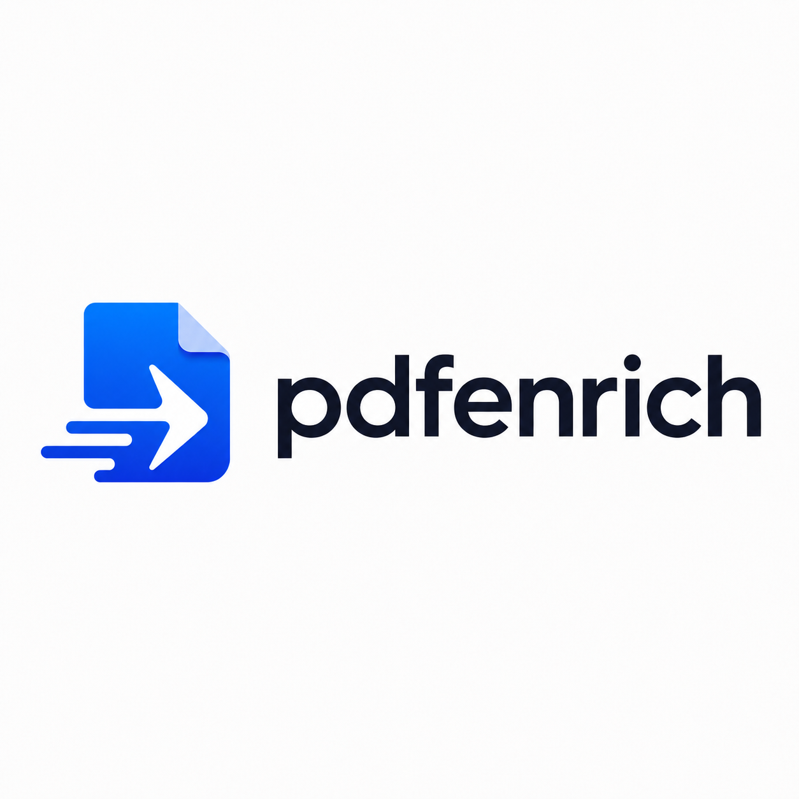

<p align="center">
  
</p>

<h1 align="center">PDFEnrich</h1>

<p align="center">
  Free and simple PDF tools for editing, signing, organizing, converting, and exporting documents in the browser.
</p>

<p align="center">
  <a href="https://pdfenrich.com"><strong>Open PDFEnrich</strong></a>
  ·
  <a href="pdf-editor/SECURITY.md">Security notes</a>
  ·
  <a href="https://pdfenrich.com/privacy">Privacy policy</a>
  ·
  <a href="https://pdfenrich.com/terms">Terms</a>
</p>

## About the project

PDFEnrich is a responsive React application for completing common PDF tasks without a paid plan or PDFEnrich watermark. Guest document workflows are browser-first, and the project includes optional authentication and private-document infrastructure for configured environments.

The product includes:

- A full PDF editor with text, images, drawing, highlights, shapes, links, notes, signatures, undo/redo, zoom, thumbnails, and page management.
- PDF organization tools such as merge, split, rotate, reorder, extract, and delete pages.
- Conversion workflows for PDF, image, and Office-oriented formats.
- Compression, OCR, form filling, signing, and export workflows.
- A browser-local dashboard for recent documents and recovery.
- Responsive desktop and touch-first mobile editing experiences.
- Public tool pages, guides, comparison pages, legal pages, metadata, sitemaps, and structured data.

## Product principles

- **Free and simple:** no subscriptions, checkout flow, paid tiers, or product watermark.
- **Browser-first:** guest editing and conversion are designed to run locally in the browser whenever the workflow supports it.
- **Privacy-aware:** PDF bytes, document text, signatures, and form values must not be placed in analytics, logs, or request URLs.
- **Honest states:** unavailable, loading, empty, and failed operations are shown directly instead of being replaced with mock success data.
- **Accessible and responsive:** keyboard, touch, mobile reflow, contrast, focus, and reduced-motion behavior are part of the release checks.

## Technology

| Area | Stack |
| --- | --- |
| Frontend | React 19, React Router, Vite 6 |
| PDF rendering and editing | PDF.js, pdf-lib |
| OCR and image processing | Tesseract.js, OpenCV.js |
| Document exports | docx, docx-preview, PptxGenJS, JSZip-compatible compression utilities |
| Authentication | Firebase Authentication |
| Optional private APIs | Firebase Functions and Supabase Edge Functions |
| Testing | Vitest, Playwright, Node test runner |
| Hosting | Vercel-compatible static build |

## Repository layout

```text
.
├── pdf-editor/              # React application and Firebase Functions
│   ├── functions/           # Authenticated backend functions
│   ├── runtime-public/      # Production public assets
│   ├── scripts/             # Build, SEO, sitemap, and quality checks
│   ├── src/                 # Application source
│   ├── tests/               # Unit, integration, security, browser, and E2E tests
│   └── vercel.json          # Production routing and security headers
├── supabase/                # Supabase functions and migrations
└── .github/                 # GitHub configuration and workflows
```

## Local development

### Requirements

- [Node.js 22](https://nodejs.org/)
- npm, included with Node.js
- A current Chromium-based browser for full browser testing

### Install and run

```bash
git clone <repository-url>
cd <repository-directory>/pdf-editor
npm ci
```

Create a local environment file from the committed template:

```bash
# macOS or Linux
cp .env.example .env.local

# Windows PowerShell
Copy-Item .env.example .env.local
```

Then start the development server:

```bash
npm run dev
```

Open the local address printed by Vite.

The public tool pages and browser-local editor can run without Firebase credentials. Authentication, App Check, analytics ingestion, and private-cloud operations require the corresponding development environment to be configured.

## Environment configuration

The root template is [`pdf-editor/.env.example`](pdf-editor/.env.example). Copy it to `.env.local` and fill only the values needed for the workflow you are testing.

Important rules:

- Never commit `.env`, `.env.local`, service-account keys, access tokens, or production credentials.
- Variables prefixed with `VITE_` are bundled into browser code. They must never contain server secrets.
- Keep backend-only settings in the relevant server environment, not in the frontend template.
- Use synthetic documents for development and bug reports; do not use real customer PDFs or signatures.
- Treat cloud controls as inactive until they have been deployed and verified in the target environment.

See [`pdf-editor/SECURITY.md`](pdf-editor/SECURITY.md) for the data flow, deployment boundaries, threat model, and verification checklist.

## Useful commands

Run these commands from `pdf-editor/`:

| Command | Purpose |
| --- | --- |
| `npm run dev` | Start the Vite development server |
| `npm run build` | Run editorial checks, generate the sitemap, build, prerender public routes, and audit the public bundle |
| `npm run preview` | Preview the production build locally |
| `npm run lint` | Run ESLint |
| `npm run typecheck` | Run the JavaScript/TypeScript project check |
| `npm test` | Run the Vitest suite |
| `npm run test:security` | Run the focused security suite |
| `npm run test:e2e` | Build and run Node-based end-to-end checks |
| `npm run test:browser` | Build and run Playwright browser tests |
| `npm run test:quality` | Run the complete product-quality release checks |

## Verification before a pull request

At minimum, run:

```bash
npm run lint
npm run typecheck
npm test
npm run build
```

For authentication, storage, sharing, signing, analytics, uploads, or security-header changes, also run:

```bash
npm run test:security
```

Use the browser and end-to-end suites when a change affects a complete user workflow.

## Security and responsible disclosure

Please do not open a public issue containing a real PDF, signature, access token, storage key, private link, or personal information. Report suspected vulnerabilities privately to the operator of `pdfenrich.com`, using a synthetic file and redacted request details.

Implementation in this repository is not proof that a cloud control is active in production. Review [`pdf-editor/SECURITY.md`](pdf-editor/SECURITY.md) before describing IAM, App Check, malware scanning, backups, lifecycle policies, quotas, alerts, or private storage as deployed.

## Contributing

1. Create a focused branch.
2. Keep unrelated working-tree changes out of the commit.
3. Add or update tests for behavior changes.
4. Verify desktop and mobile layouts for visible UI changes.
5. Run the relevant checks listed above.
6. Open a pull request with the user problem, implementation summary, and verification evidence.

## License

No open-source license is currently included with this repository. All rights are reserved.
